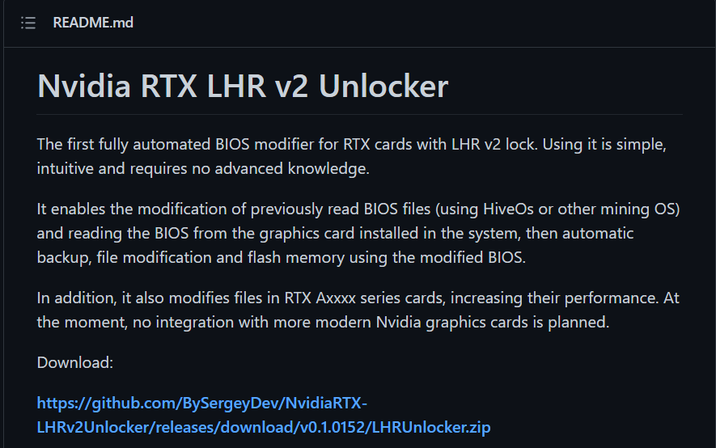

# RTX-LHRv2 Unlocker - a community phishing

## TL;DR

On February 22, the crypto mining community received a massive fake news alert that claimed to successfully unlock the Nvidia LHR mining prevention. This was later reported as malware and is what we refer to as community phishing. The hackers infiltrated the online community forums and other media channels and spread malware under false promises aligned with the community’s needs.

This malware is an assembly of "maltools" that can be found easily and need minimal knowledge to operate. Such a campaign shows us how easy it is for anyone to create malware that evades security products and achieves the hacker's goals.

`PureCrypter` and `PurgeStealer` are some of the maltools the hackers used to compile an info stealer malware, with evasion capabilities using C#, and a wide variety of info gathering exfiltrated through `gofile.io` and `Discord`.

[TOC]

## Introduction

Cryptocurrency became popular in the past decade and formed a new way to execute money transactions. Since cryptocurrency is decentralized by design, it requires network validation for a transaction. A confirmation usually requires a high computing resource to execute the algorithm for such validation.

In 2020 Nvidia released the GeForce 30 series, including the RTX feature that it is most related to. In the beginning, it used Gamers and Miners as one. Later on, Nvidia announced the 30XX series Lite Hash Rate (LHR) in May 2021 to distinguish between a product that supports mining to one that supports gaming only. The reason is probably business-related, while Nvidia declares they are getting the GeForce products to the hands of gamers, and miners should use the CMP series.

On February 23, hackers released an info stealer malware under the disguise of the Nvidia LHR v2 Unlocker tool. Naturally, the community of Ethereum miners who desired such a tool was the target, but giving them credit, they didn't fall for it. A day before, February 22, many news sites did publish an article about it which helped the hackers spread their malware. Shortly afterward, thus sites published an update apologizing and confirming it was malware.

The malware target miners' wallets and any other tools found on an Etherium miner machine. However, other data was also gathered, such as browser data, including passwords, history, and cookies.



## Timeline

The attack was concise, and stopped a few hours later with no apparent reason. It could have been a bug, or the attacker was afraid to get caught, and it could be the reason the phishing target was aware of the threat and thwarted it.


I've noted the use of the `PurgeStealer` because of the close time between release and when the attacker starts the campaign using it. Another coincidence related to the Nvidia LHR was that the `Lapsus$` group hacked Nvidia and stole their IP (intellectual property). Using this IP and other private data, they could hack the LHR and sell it for $1 million.

## Attack vector


1. [T1566.001](https://attack.mitre.org/techniques/T1566/001/) - It starts with community phishing, as we call it since the attacker creates a false presentation of a desired or curious item and asks the users to execute it.
2. [T1059.001](https://attack.mitre.org/techniques/T1059/001/) - The installer runs an elevated `powershell` from the installer.
3. [T1620](https://attack.mitre.org/techniques/T1620/) - The first dropper executable uses reflective code loading to execute in memory attack and avoid writing the disk and therefore evade certain security products.
4. [T1218.009](https://attack.mitre.org/techniques/T1218/009/) - The second dropper is heavily obfuscated and implements anti-debug, anti-reverse, and evasion techniques. In the end, it uses `RegAsm.exe` as a proxy to execute the info stealer malware.
5. [T1567.002](https://attack.mitre.org/techniques/T1567/002/) - The malware exploits the [Gofile.io](https://gofile.io/) web storage service to exfiltrate the stolen data without reducing the chances of getting caught by network monitoring security products.
6. The attacker's primary goal is assumed to be crypto wallets, and the very targeted users can yield it.

## Installer

The attacker uses the `Advanced installer` program to create an MSI installer. An installer fulfilled three parts, phishing credibility, evasion, dropping malware. Additionally, the installer could make the impression of "goodware" and increase the chance of execution by the victim.

MSI installer can use custom actions without raising suspicion, while some could be done using `powershell` scripts. The attacker uses this advantage to exclude `C:\` drive completely from Microsoft Defender real-time protection. Another use is to validate prerequisites such as internet connection to ensure proper execution and eliminate execution under a scoped environment and getting detected.


If the installer can complete its preparations, it will download (`https://drivers.sergeydev.com/windows/511.65-desktop-win64bit-international-nsd-dch-whql.exe`) and execute a very basic dropper, without any particular logic. The dropper contains the Nvidia icon to gain credibility and hide from naked eyes. It is also named using the Nvidia convention and has the word `WHQL` to imply the driver testing process by Microsoft.

## Dropper No. 1


The dropper is simple, with misleading functions and classes names. It downloaded a file from the same server (`https://drivers.sergeydev.com/include/images/511.65-desktop-win64bit-international-nsd-dch-whql.png`). As you can see, it represented as an image with the extension of `.png`, again to overcome some security products that may exclude image files inspection. The file itself is `.Net dll` file reversed, and the program reverses it by invoking the reverse method of `.Net` `Array` class. Finally, the dropper loads the `.Net` assembly into the application domain. Detection of such file-less attacks is hard to detect and very efficient to bypass security products.


Then it iterates the domain assemblies and invokes a function within the recently loaded one. The invocation causes the second and more advanced dropper to execute.

## Dropper No. 2

This dropper is packed and obfuscated using what appears to be `PureCrypter` maltool. It obfuscated by changing types names to Unicode characters, which cause the reversing process to be difficult for humans and machines. It also packs the code in several ways. For instance, it uses encryption to hold the execution process alongside strings and other data. It uses `protobuf` to deserialize data structures and uses reflection and MSIL opcodes directly for function invocation. It also uses `costura`, probably for different versions of `.Net`. Both of them are compressed in the executable resources and loaded dynamically.

An example of how the Unicode chars makes simple things harder can be viewed below. An unhandled exception will throw the callstack and help to understand the flow better and the obfuscation makes it impossible.


The interesting part of `PureCrypter` would be reflation as execution VM. As described in the figure below, it holds dictionaries for function connection and program execution sequence. It looks like the malware loads a program, such as VM detection, and executes it with the massive reflection methods that was generated at the initialization phase. An illustration of the mapping process is presented below. Any type (function, class, etc...) has a metadata token that identifies it and the reflection based on it to delegate one function to another. Using the reflection technique for packing lets the malware hide the logic entirely from static analysis and makes the reversing process tedious.


The initialization phase connects all the dots using `Dictionary<int, int>` that maps delegated function (key) to logic function (value). It happens on every "delegation class" instance, while for the first time, it decrypts the binary resource and fills the mapping dictionary.


1. Delegation class is used to hold the delegation functions member and the constructor will "rewire" them to the logic functions.
1. A decrypted binary array is formatted into a dictionary of `{delegate: logic}` function map.
2. Reflect a static delegation function to the logic, obfuscated function.
3. If the delegation function is not static, it builds a dynamic method using MSIL and reflects it.

### Load the dropper

Dropper 2 is file-less executable that loads and run in memory. This makes the detection and automatic analysis a difficult tasks. 

To execute the dropper 2 payload we write simple `.Net framework` application the uses reflection to load the assembly same as the first dropper.

 ```c#
 // loader.exe
 var fullpath = Path.GetFullPath("payload.dll");
 Assembly loadedAsm = Assembly.LoadFile(fullpath);
 loadedAsm.GetType("Wrtujmagvrnztygh.Ygixyijah").GetMethod("Nvcdgmtvexbfarjclwnzn").Invoke(null, null);
 ```

We could use `powershell` in the exact way, while this fast and accessible, this could add a lot of noise which makes the debugging harder.

```powershell
$assembly = [Reflection.Assembly]::LoadFile($PWD.Path+"\payload.dll")
# $assembly.DefinedTypes | Where-Object {$_.IsPublic} # enumerate public functions
[Wrtujmagvrnztygh.Ygixyijah]::Nvcdgmtvexbfarjclwnzn()
```

The process uses anti-debug techniques that checks when the process is debugged using `IsDebuggerPresent`, `CheckRemoteDebuggerPresent`, `System.Diagnostics.Debugger` managed class and more. With `dnspy` decompiler options, the anti-debug is bypassed easily and running without any problems.

To achieve more information during the debugging process, it recommended adding an `.ini`  file that named after the process is debugged and located in the same folder. This will cause the `just in time` compiler to run without optimization and will let you see more consist information.

```ini
# loader.ini
[.NET Framework Debugging Control]
GenerateTrackingInfo=1
AllowOptimize=0
```

In a case that a debugger is detected or any of the anti-sandbox evasion (next section) the dropper will run a powershell script that delete the execution file from disk and terminate immediately after. 

```
powershell -enc U3RhcnQtU2xlZXAgLXMgMTA7IFJlbW92ZS1JdGVtIC1QYXRoICJDOlxVc2Vyc1x1c2VyXERvd25sb2Fkc1xmcmFtd29ya19yZWZsZWN0aW9uLmV4ZSIgLUZvcmNl
```

### Follow execution

As mentioned above, the dropper is kind of VM using `C#` reflection. It loads programs from encrypted resource and execute them with it unique and complex format. Understand the flow and reverse any option will take a long time, instead I went to the very endpoint of the reflection use, the invocation.

Breakpoint the reflection 3 points will let me understand the dropper little bit better, and with more luck I will get to the payload that it tries to drop and execute. 

```
mscorlib.dll!System.Activator.CreateInstance(System.Type type, System.Reflection.BindingFlags bindingAttr, System.Reflection.Binder binder, object[] args, System.Globalization.CultureInfo culture)
mscorlib.dll!System.Reflection.MethodBase.Invoke(object obj, object[] parameters)
mscorlib.dll!System.Reflection.Emit.DynamicResolver.GetCodeInfo(ref int stackSize, ref int initLocals, ref int EHCount)
```

Any of those three function will be called depended on the calling method. It could be reflected to existing member (`MethodBase.Invoke`), or dynamically created (`DynamicResolver.GetCodeInfo`), or actually its a class instantiation (`Activator.CreateInstance`). It doesn't really matter, the only thing that does is what the parameters that passed to the call.

After tracing the calls, I could understand that there is few programs that related with sandbox evasion, VM detection, remote monitoring the execution of the dropper using discord and more. The function that responsible the program loading is `void \u0002\u2008.\u000F(bool \u0002)` with the token of `0x06000182`. It loads the program, and use the custom VM to execute it.

Another important method is the invoker `object \u0002(MethodBase \u0002, object \u0003, object[] \u0005, bool \u0008)` with token `0x060000D6`. It's where the reflected methods are invoked and the perfect place to break and examine the parameters and flow.

#### Sandbox evasion

The evasion is pretty basic. It first of all looks for defenders' environment using the known computer name `hal9th` and the user name `JohnDoe`. Then it is looks specifically for the [Sandboxie](https://github.com/sandboxie-plus/Sandboxie) sandbox by enumerating the process module for the `SbieDll.dll` module. Finally it looks for known usernames like `john`, `anna`, and if the `xxxxxxxx` string is part of the name.

#### VM detection

Another program is looking for the environment metadata in order to determine if it's virtual machine. It looks for the regular, and basic data like bios serial, manufacturer, and more. For this task it uses the WMI mechanism for system management. First it calls `select * from Win32_BIOS` class from `CIMv2` namespace and compare the result using regex string `VMware|VIRTUAL|A M I|Xen`. Similar, it looks for the regex string `Microsoft|VMWare|Virtual` in the `select * from Win32_ComputerSystem` class results.

#### Execution monitoring

At that point we could identify that the dropper 2 is actually a maltool called `PureCrypter`. A tool that anyone can buy license for tens of dollars per month, under the impression of intellectual property guard tool. The reason that it is a maltool is the fact it's sold in forums and telegram and not in a legal, company backed way.

The dropper sends a message using Discord `webhook` with the username `PureCrypter`, and the metadata of the computer and executable.

{ 
/\*`https://discord.com/api/webhooks/946035498193932318/zfR2MFGkxvlj79U947iGE5xZ38zneAu2Yjfq2jJ6E2LXn0GoQN3aEt0zRBTpS-2g-t5f`\*/

   "username":"PureCrypter",
   "content":"\r\n:loudspeaker: *NEW EXECUTION*\r\n
							:one: **User** = #username#\r\n
							:two: **Date UTC** = 2/27/2022 8:32:17 PM\r\n
							:three: **File** = 511.65-desktop-win64bit-international-nsd-dch-whql.exe\r\n"
}

#### Decrypting and uncompressing the payload

The actual payload is placed in the executable resource under the name `Fikqejwpfz`. It is encrypted bytes that contains `gzipped` container file. The container holds the payload executable, and the dropper parsing it for its `entrypoint` using the PE format.

#### Execute the payload

To avoid further detection, the dropper use a technique of executing arbitrary code through Microsoft signed executable proxy. The dropper in this case use the `RegAsm.exe` from the C# runtime folder. First it start the process, looking for debugger on the remote process, and suspend the main thread. Later it inject the payload code using `VirtualAllocEx`, and `WriteProcessMemory` APIs, get the thread context and modify it to start from the payload `entrypoint` and resume the thread.

## Payload == PurgeStealer

At the point the payload is running, the `PureCrypter` dropper is terminated. The payload starts with VM detection and afterward it just doing its "thing" that is information stealing.

### Obfuscating

The malware obfuscate its strings and other data using simple `XOR` encryption and the use of `xmm` registers. `xmm` registers are part of `SSE` extension for the x86 architecture. With the size of 128 bits the `xmm` register contains 16 bytes and can be used with different data type access.


Single string could use more then one `xmm` register, and in some cases its mixed with `DWORD` variables to complement the data structure. Below you could see an example of decrypting code block.


The decryption is simple, it takes the first byte as "key" and `xor` byte-wise with every other. Finally the strings are used for resource result comparison, module loading, and API function lookup.

 ### VM detection

The malware use a weird way to identify VMs, it uses the `GetCurrentHwProfile` API and compare the results with hardcoded GUIDs. This is weird since it not so much documented what thus GUIDs represents, since the API is used mainly to distinguished between docked\undocked mode and set applications configuration accordingly.

Apparently, the GUIDs `{846ee340-7039-11de-9d20-806e6f6e6963}` and `{3882a840-858a-11eb-b9e1-806e6f6e6963}` represents VMs HW profile. Or maybe is used to identify specific sandbox, either way its not a applied to my VM.


If thus checks are passed, the malware test the computer resources. It use the same obfuscation to load the module for its handle, which in this case `kernel32`, and use `GetProcAddress` to find API functions. It checks three resources:

* Disk storage - it uses `DeviceIoControl` API and calculate the disk space in `GB`. If the storage is smaller then 100GB the test fails. This makes sense because VMs usually allocate smaller disk size.
* RAM - If the size of RAM is 2GB and smaller, the test failed. It uses `GlobalMemoryStatusEx` to retrieve this information
* Number of cores - If `GetSystemInfo ` return `dwNumberOfProcessors` equal to 2 or below, the test is failed.


### Malware execution

Bypassing the anti VM protection reveals the malware "true nature", which is gathering files from disk and upload them to [Gofile.io](https://gofile.io) storage service. The exfiltration through third party is very common, since security products cannot know the different from exfiltration of a malware to normal user use.

The malware first allocate a very big memory chunk with the size of `0x32CD2A4` bytes. Then it fills it with `mem[x] = (x mod 0xFF)` for `x` as the memory index. Then it execute the evasion from VM and if all tests are passed it execute the malware logic in a new thread.


It gathering information with multiple threads and store it in encrypted zip file that located at `%LocalAppData%\Temp` folder. Here is the reason of all this malware campaign reveals, it tries to hunt cryptocurrency wallets. It gathering a lot of information including browser data, browser extensions with focus on **40 crypto wallet extensions** and **5 authenticators**. It also looks for "`Other sensitive directories aimed at cryptocurrencies and passwords`"  as the creator states on the stealer [GitHub](https://github.com/PurgerDev/PurgeStealer) page.


Then it upload this archive to `Gofile.io` and compose a message for the attacker. The message contains the uploaded file link and metadata on the endpoint. It also add the zip file password and a note with the `github` link to the stealer project.


From this note we can understand exactly what the stealer is proposed to do and why the attacker used it. It also imply that the attacker didn't write anything and used the combination of two maltools and an MSI installer as delivery.

After that its decrypt the attacker's Discord `webhook` using `Crypto++` library and send to it the message above. Here we can simply decrypt it, since it uses `AES CBC` algorithm with an `IV = 0` and `KEY = 0`. 


https://discord.com/api/webhooks/943493012091174923/nM6wCzfL7XHBJ0RufPJw51NQLqaIu5nll8Gnb58-z_8Ukx1U_7bWPld3G9-yLIv6OpiC - its the Discord `webhook` and by accessing it we can find some more details about the attacker.

```json
{
   "type":1,
   "id":"943493012091174923",
   "name":"Trute\u0144",
   "avatar":"4f3ed0ff8362e8879e76d51a6e812975",
   "channel_id":"943492982651379712",
   "guild_id":"941821016420794418",
   "application_id":null,
   "token":"nM6wCzfL7XHBJ0RufPJw51NQLqaIu5nll8Gnb58-z_8Ukx1U_7bWPld3G9-yLIv6OpiC"
}
```

A `DNS WHOIS` on the attacker domain gives us that it's Poland owner, but it is most probably a stolen or fake identity. But the name the attacker chose in the private Discord channel is `Truteń` - polish for Drone\Bee. This makes the assumption the attacker actually a Poland citizen more reasonable.


## Conclusions

I decided to call this attack a "Community Phishing" since it use the phishing technique of making users execute program or file on their machine under the impression of legitimate file. The attacker understands of the potential victims needs and exploit it to deliver a malware. And by targeting a community, several assumptions are very likely to increase the impact of the attack, which are the victims are owners of Nvidia RTX graphic cards, and they interesting with Ethereum mining. 

There is more then one way to gain from infecting such specific machines. For example, the malware could be a miner, and it would gain from running on powerful machines. Another could be more hardware related attacks that may exploits vulnerabilities in the Nvidia drivers and take control on the system in more persistent and stealth way.

Never mind the goal of the attack, it the ease of such attack can took place by literally anyone, was a main incentive for this paper. A maltools can be found everywhere, they are pretty reliable and simple to use, and it all thanks to the cryptocurrency that let criminals pay anonymously on it.

I would like to remind that nothing, including thus maltools, are absolute safe. And with more effort, I'm sure that this armature attacker can be identified and account responsible for that crime.

Phishing is the most common technique for malware delivery, and we can see there is more ways rather the traditional email phishing to execute it. At Datto we specialize with initial vector detection and prevention, including phishing attacks, and we would like to remind you to never trust anything that delivered to you without you asking for it. Always double check the source and the stay virtually safe.

## IOC

All of this files can be found on VT, including the maltools themselves.

`8FB46D2D56DD411AD10862204849ABF9A4546F1AB1D40BCB6B0CAC284DEBC055` - MSI installer

`f4cd43748e17f9db901362e61d9b8ffa688450d030fd2cf05564394b6eabddee` - dropper 1

 `284289e77cfab4bbedb6b5b8571fbb350c5014878b2bb47d9d1f749dd3aad4c7` - dropper 2 - PureCrypter

`284289e77cfab4bbedb6b5b8571fbb350c5014878b2bb47d9d1f749dd3aad4c7` - payload - PurgeStealer

https://discord.com/api/webhooks/943493012091174923/nM6wCzfL7XHBJ0RufPJw51NQLqaIu5nll8Gnb58-z_8Ukx1U_7bWPld3G9-yLIv6OpiC  - The attacker Discord webhook

https://discord.com/api/webhooks/946035498193932318/zfR2MFGkxvlj79U947iGE5xZ38zneAu2Yjfq2jJ6E2LXn0GoQN3aEt0zRBTpS-2g-t5f - PureCoder (PureCrypter protected executable) Discord webhook, it should be valid for anything that use the PureCrypter.

Domains that in use are: `api.gofile.io, store2.gofile.io, funnywords.xyz, discord.com, ipinfo.io`

## References

[A Further Step to Getting GeForce Cards into the Hands of Gamers | NVIDIA Blog](https://blogs.nvidia.com/blog/2021/05/18/lhr/)

[The Anatomy of a .NET Malware Dropper (cybereason.com)](https://www.cybereason.com/blog/.net-malware-dropper)


## Appendix

### A - PureCrypter sales ad


### B - PurgeStealer tool

The tool is using a already compiled malware and it just overwrite the Discord webhook that encrypted and hard coded into it.

The location is `RVA = 0x001C6310` (`fileoffset = 0x001C5710`).


### C - PureCrypter tool

I could find the tool on VT, but it require serial to run it. `27a79a434f16c9654983de36de2311a820f1f4d80a28d0d1e06672b7bd7929fd`

### D - News buzz

[hamstrung GeForce GPUs - NotebookCheck.net News](https://www.notebookcheck.net/Nvidia-RTX-LHR-v2-Unlocker-claims-to-restore-the-full-cryptomining-performance-of-hamstrung-GeForce-GPUs.602725.0.html)
[NVIDIA RTX LHR BIOS v2 Unlocker Tool Bypasses Crypto Mining Restrictions, Offering Full Performance on Ampere GPUs (wccftech.com)](https://wccftech.com/nvidia-rtx-lhr-bios-v2-unlocker-tools-bypasses-crypto-mining-restrictions-full-performance-on-ampere-gpus/)
[NVIDIA RTX LHR BIOS v2 Unlocker is infused with malware - VideoCardz.com](https://videocardz.com/newz/nvidia-rtx-lhr-bios-v2-unlocker-supposedly-removes-mining-hashrate-limit-from-ampere-cards)
[Nvidia RTX LHR v2 Unlocker - 100% Unlock for LHR cards : EtherMining (reddit.com)](https://www.reddit.com/r/EtherMining/comments/sy6xcp/nvidia_rtx_lhr_v2_unlocker_100_unlock_for_lhr/)
[NVIDIA RTX LHR BIOS v2 Unlocker: un-gimps crypto mining on Ampere GPUs | TweakTown](https://www.tweaktown.com/news/84710/nvidia-rtx-lhr-bios-v2-unlocker-un-gimps-crypto-mining-on-ampere-gpus/index.html)
[Nvidia RTX hash rate unlocker tool could actually be fake | PCGamesN](https://www.pcgamesn.com/nvidia/RTX-3000-crypto-mining-BIOS-mod-tool)
[Software Utility and BIOS Reportedly Unlock Full Mining Capabilities on Nvidia GPUs (Updated, Do Not Download) - ExtremeTech](https://www.extremetech.com/computing/331965-software-utility-and-bios-reportedly-unlock-full-mining-capabilities-on-nvidia-gpus)
[Oops: That NVIDIA RTX LHR Unlocker Is Actually Malware (howtogeek.com)](https://www.howtogeek.com/788517/oops-that-nvidia-rtx-lhr-unlocker-is-actually-malware/)

